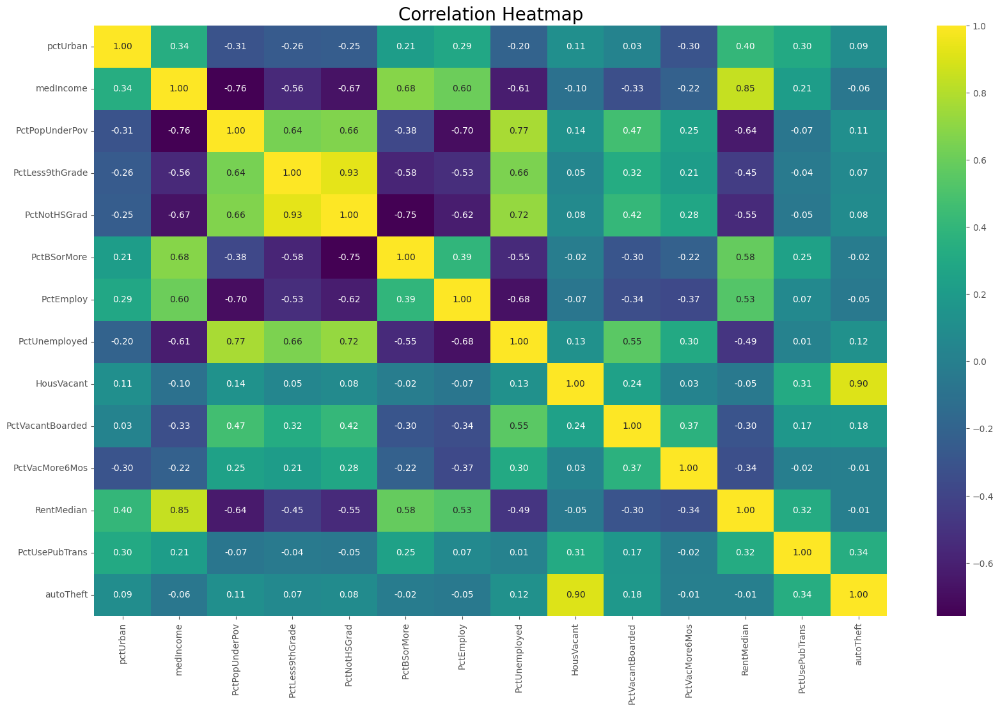
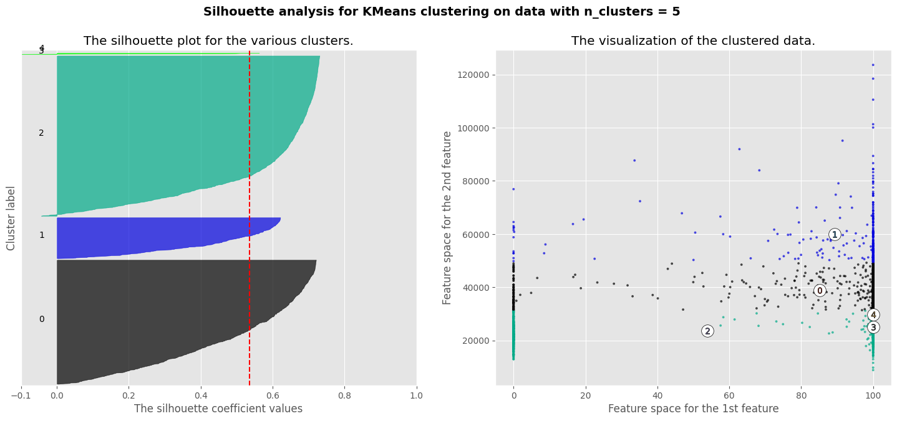

# Auto Theft and Social Disorganization Theory
#### Omar Brandon, Ryan Kaplan, Paula McCree-Bailey, and Rohitha Sanka

## Objective
The project should focus on a problem involving the analysis of one or more data sets and the application of machine learning and data mining methods to better inform policing and crime prevention efforts and policies. Building models that can identify patterns in the community crime dataset to help organizations better understand community factors and crimes and give them an advantage when making decisions in their fight against crime, better policing and safer communities. 

## Introduction
Every 31 seconds a car is stolen in the United States, which equates to more than 1 million annually (Straughan, 2024). Data published by the FBI unveils that motor vehicle theft (MVT) is one of the most common crimes in the US but one of the least researched topics (Suresh and Tewksbury 2012). The loss of an automobile can pose significant financial and emotional distress on individuals which results in a disrupted lifestyle pattern. The social disorganization theory, introduced by Clifford Shaw and Henry McKay, aligns closely with our topic of auto theft. This theory emphasizes how environmental factors influence delinquency and criminal behavior (Mendez, Spencer, & Stith, 2019). 

Exploring the relationship between auto theft and social disorganization we see the motivation behind car thieves is emphasized. It was found that many thefts operate on a risk-versus-reward basis. Essentially feeding the concept of an easy to steal vehicle with a higher market value becoming a target (EloGPS 2023). Other factors such as theft for profit, theft to secure transportation, also known as joyriding, were identified as frequent motives committed by adolescents or young adults (Suresh and Tewksbury 2012).

Throughout this research paper and the technical models built, our study identifies how higher vacant housing rates correlate to auto theft crime rates. The goal of this study targets the main question, how does the presence of vacant housing contribute to an increase in auto theft rates in neighborhoods, and to what extent can social disorganization theory be used to predict this relationship? To accomplish this, the psychology of why and how auto theft occurs is examined, along with the influence of high housing vacancy rates, aiming to bring a solution by emphasizing security measures within a neighborhood. While addressing socio economic challenges and encouraging urban planning, community engagement, and improved law enforcement strategies, the problem can be effectively mitigated. Furthermore, the research and result of the combination of literature and machine learning models emphasizes techniques and prevention of auto theft.

## Background
According to Shaw and McKay's work, neighborhoods characterized by weak social cohesion, poor community organization, and high levels of social disorganization are more prone to elevated crime rates, including auto theft. Their pioneering research linked juvenile delinquency and broader criminal behavior to the breakdown of neighborhood social structures. Specifically, the absence of stabilizing institutions, such as strong religious organizations, high-quality schools, and enriching after-school activities, diminishes informal social controls and allows criminal behavior to thrive. This foundational framework helps systematically examine the social and environmental factors that lead to auto theft.

Subsequent studies have validated the relevance of social disorganization theory in explaining modern crime patterns. (Sampson and Groves 1989) expanded this framework, demonstrating that communities marked by low socioeconomic status and family disruption are more likely to experience property crimes, including auto theft. Similarly (Lee et al., 2016) reinforced these findings, illustrating how racial heterogeneity, residential instability, and weakened social ties exacerbate the risk of crime by dismantling the social cohesion necessary to maintain order. Their research emphasized that weakened social ties and disrupted family structures directly undermine collective efficacy, leaving neighborhoods vulnerable to criminal activity. Despite these advances, gaps remain in fully understanding the interplay between socio-economic dynamics and emerging challenges like urban gentrification, technological changes, and variations in housing policies. These areas warrant deeper exploration.

The integration of social disorganization theory into this study reinforces its strength as a guiding framework. It offers an evidence-based foundation for interpreting the relationships between socio-economic factors such as poverty, unemployment, housing vacancy, and auto theft rates. By addressing these structural issues, we aim to identify actionable insights that can inform community-level interventions and policies. Examples of these strategies include neighborhood watch programs that aim to foster community cohesion and collective efficacy, which has been shown to reduce crime. Research by (Bennett, Holloway & Farring, 2006) suggests that active neighborhood watch programs can lead to a reduction in property crimes, including auto theft, as they increase surveillance and informal social control in the community. However, the effectiveness of such programs can vary, particularly in socially fragmented areas, highlighting the importance of tailored approaches.

## Data
The Communities and Crime dataset contains 2,215 observations and 147 features which combined socio-economic data from the 1990 U.S. census, law enforcement data from the 1990 U.S. Law Enforcement Management and Administrative Statistics (LEMAS) survey and the 1995 FBI Uniform Crime Report (UCR) crime data. The range of features include percentage of urban, median income, race per capita, percentage population under poverty, marital status, information on police officers in the community and various types of criminal offenses, provide a lot of information for algorithm predictions. 

### Pre-Processing 
The dataset required significant pre-processing to prepare it for analysis, particularly in terms of handling missing values. Some of the features contained missing values, which were represented by the symbol "?". Rather than attempting to impute missing data, which could introduce bias or reduce the integrity of our analysis, we opted to remove all rows containing missing values. 
```
autoCrime =  autoCrime.apply(pd.to_numeric, errors='coerce')
autoCrime = autoCrime.replace('?', float('nan'))
autoCrime = autoCrime.dropna()
```
After this entire process, our dataset was left with 2,212 observations and 20 features that we would be looking at. This decision ensured that the remaining dataset was complete and that our analysis could be conducted without concerns about incomplete data.

### Feature Selection
To gain further insight, a heatmap was created to illustrate the strength and direction to the relationships between the features and the target variable. Overall, most of the correlations are nearly zero, which suggests that there is no meaningful relationship between these two variables. For clarity, the number of features shown in the results (Figure 2) was reduced to thirteen, revealing several noteworthy correlations. The heatmap shows the strongest positive correlation of 0.90 between auto theft and house vacancy, suggesting that as house vacancies increase, the number of auto thefts also rises. Additionally, there is a moderate positive correlation of 0.34 between public transportation and auto theft. Other relationships include Auto Theft and Percentage Boarded Vacant houses with 0.18 correlation , Auto Theft and Percentage Unemployed with 0.12 correlation, and Auto theft and Percent Poverty with 0.11 correlation. All these correlations are positive, suggesting that as one feature increases, the other is expected to increase as well.



We dropped features that were not relevant to the research focus, simplifying the dataset to only include socio-economic factors that could potentially influence auto theft rates.
## Model Selection
### Baseline 
The baseline models under consideration include Multiple Linear Regression for continuous target variables, Decision Trees, Random Forest, Naive Bayes, and Gradient Boosted Predictive Models. Cross-validation was applied to each model to improve the reliability of the model’s performance. For all five models, the best performance was observed when k = 10. With 10-fold cross-validation, each fold is using 90% of the data for training and 10% for testing, providing a better training process compared to 80% training set used in 5-fold cross-validation. Additionally, a larger number of folds reduces the variance in the model. The findings for this process are summarized in Table 2.


The best model is evaluated based on the mean R2, mean MSE and mean RMSE. The mean R2 is the average of the R2 values across all folds, providing an overall measure of how the model explains the variability in the data. Overall, the best model performance is achieved with multiple linear regression when k-fold = 10 with a mean R2 of 91.32% across all folds. This means over 91% of the variance in autoTheft, the target variable, is explained by the selected features in the model. Besides the highest mean R2, random forest also has the lowest mean MSE and RMSE. However, despite these metrics, linear regression may not be the best model. After plotting residuals, examining their distributions, and analyzing the Q-Q plot, it appears that linear regression does not adequately fit the dataset. These diagnostic plots revealed patterns and deviations that suggest the assumptions underlying linear regression are not fully met. Therefore, alternative models, such as random forest, which better handle the complexity and potential non-linearity in the data, should be considered.
Random forest performed second best with a mean R2 of 82.82%. It performed better by building and combining the results from multiple decision trees which reduces the chances of overfitting. By averaging the results, random forest performs better on new, unseen data. 

### Hyparameter Fine Tuning
The models were further fine-tuned by applying grid search to Lasso Regression (L1 penalty), Ridge Regression (L2 penalty), Decision tree, random forest, gradient boosting, and Naive bayes. Hyperparameter tuning is an important step in optimizing machine learning models (ML). By using predefined hyperparameter values, grid search makes sure that the model is tuned to achieve the highest accuracy. The findings for this process are summarized in Table 3.


After hyperparameter tuning, the best models were Lasso and Ridge regression with R2 of nearly 79%. Despite their ability to reduce and remove less relevant features, these models did not outperform the baseline Random Forest at k = 10.

### Clustering
K-means is an unsupervised algorithm used for clustering.  This iterative process ensures that the clusters are as compact and well-separated as possible. Overall k-means is relatively simple to implement, and scales well to large data sets. The drawbacks include k must be chosen manually and it has difficulty scaling data with a large number of features.  According to the elbow method, the optimal cluster is 5.  To confirm the selection from the elbow method, silhouette analysis was applied to the model. Silhouette measures similarities and differences within the clusters compared to other clusters where a higher value indicates a better-defined cluster; however, it is important to observe the quality or shape of the clusters, as a higher number does not always indicate the best model. The results from the analysis are displayed in table 4.


The highest score was achieved with n = 2 clusters, yielding a score of 0.5638, as shown in Figure 3. Despite this high score, the silhouette plot for two clusters reveals that the clusters are not uniform. One cluster is considerably larger than the other indicating that the data within that cluster could be further divided into small clusters.  Ideally, all clusters should have similar average silhouette scores, indicating uniform separation. In addition, values should be positive with a narrow spread implying tight clusters. In the visualization for n = 5, which was selected as optimal using the elbow method, the clusters are not uniform, despite the silhouette score being 0.5353 as shown in Figure 5. This could suggest several possibilities: the data does not naturally form well-defined clusters, the chosen clustering algorithm and parameters are not capturing the true structure of the data, or data has overlapping or complex patterns that are not well-suited to simple clustering techniques. Cluster analysis is not the best tool for analysing the data. 


Overall, the best model for our data is Random Forest with a r-squared of 82%.  

## Discussion
This research aimed to address the factors influencing auto theft through the lens of social disorganization theory by examining socio-economic predictors and applying machine learning models. Our random forest model exhibited the strongest predictive performance across its metrics, the model highlighted key variables—housing vacancy, unemployment rates, and education levels—as significant contributors to the incidence of auto theft. Our methodological adjustments, including feature selection and binning, aimed to simplify data representation and improve interpretability but may have contributed to the limitations of our models. To mitigate auto theft effectively, we propose two actionable solutions. The first being targeted community revitalization programs, based on the findings that housing vacancy strongly correlates with increased auto theft rates, community revitalization programs focusing on reducing vacant properties could help address this issue. Evidence suggests that policies incentivizing property rehabilitation, affordable housing development, and community engagement can strengthen neighborhood stability and reduce crime. For instance, neighborhood watch programs combined with environmental design strategies, such as improved street lighting and surveillance systems, have shown a 30% reduction in property crimes, including auto theft​ (Welsh & Farrington, 2008). Our second proposed solution is technological interventions and awareness campaigns, enhancing vehicle security through the adoption of anti-theft technologies, such as immobilizers and GPS tracking systems, is another effective solution. Studies report that vehicles equipped with such technologies exhibit a recovery rate of over 90% when stolen compared to a general recovery rate of about 50%​. Additionally, public awareness campaigns focused on educating residents about locking vehicles, removing valuables from sight, and reporting suspicious activity can further deter opportunistic theft (Prasetyo & Hidayat, 2021).

Despite these proposed solutions, the limitations of this research should be acknowledged. The dataset used, while comprehensive, is dated and lacks representation of modern vehicle technologies and socio-economic dynamics. This may have affected the models' ability to capture contemporary patterns in auto theft. Furthermore, excluding incomplete rows may have reduced the generalizability of our findings.

Future research should incorporate real-time data, such as recent vehicle theft trends and socio-economic updates, and explore advanced machine learning techniques to improve model accuracy. Moreover, integrating insights from community stakeholders could ensure interventions are equitable and contextually relevant, addressing systemic inequalities while fostering community trust and collaboration. By emphasizing both root causes and technological deterrents, these findings provide a foundation for multi-faceted interventions aimed at reducing auto theft, reinforcing the critical role of community stability in crime prevention.
 
## Conclusion
In conclusion, this study set out to examine the relationship between social disorganization and auto theft using socio-economic and law enforcement data. By employing predictive models and focusing on key variables such as unemployment rates, poverty levels, housing vacancy, and educational attainment, we identified significant socio-economic predictors of auto theft in various communities. The findings reinforce the importance of social structures in crime prevention, showing that weakened community cohesion and economic instability contribute to higher rates of auto theft.

The integration of supervised and unsupervised machine learning models enhanced our understanding of these dynamics. While the supervised models quantified the relationships between specific variables and auto theft rates, the unsupervised models provided deeper insights into community-level patterns, uncovering unique clusters and unexpected anomalies. These methods together emphasized the complexity of the factors driving auto theft and bring out the need for context-specific interventions.
Furthermore, this research underscores the ethical responsibility to address systemic inequalities and engage with stakeholders when designing crime prevention strategies. Policies that strengthen communities, reduce housing vacancy, and create economic opportunities can address the base causes of auto theft, rather than simply its symptoms. Working with local governments, law enforcement, urban planners, and community members will be essential to bringing on equitable and effective solutions.

## References

References
Bennett, T., Holloway, K., & Farrington, D. P. (2006). Does neighborhood watch reduce crime? A systematic review and meta-analysis. Journal of Experimental Criminology, 2(4), 437–458. https://doi.org/10.1007/s11292-006-9018-5

Bowers, K. J., Johnson, S. D., & Hirschfield, A. (2004). Closing off opportunities for crime: An evaluation of alley-gating. European Journal on Criminal Policy and Research, 10(4), 285-308. https://link.springer.com/article/10.1007/s10610-005-5502-0 

Chelsea M. Spencer, et al. “The Role of Income Inequality on Factors Associated with Male Physical Intimate Partner Violence Perpetration: A Meta-Analysis.” Aggression and Violent Behavior, Pergamon, 22 Aug. 2019, www.sciencedirect.com/science/article/abs/pii/S1359178918302726. 

FBI. (2016, August 16). Motor vehicle theft. FBI. https://ucr.fbi.gov/crime-in-the-u.s/2015/crime-in-the-u.s.-2015/offenses-known-to-law-enforcement/motor-vehicle-theftTheft 
Lee, B., Lee, J., & Hoover, L. (2016). Neighborhood characteristics and auto theft: An empirical research from the social disorganization perspective. Secur J, 29, 400–408. https://doi.org/10.1057/sj.2013.35 
National Insurance Crime Bureau. (2020). Vehicle theft prevention tips. NICB. https://www.nicb.org/prevent-fraud-theft/vehicle-theft-prevention 

Prasetyo, E., & Hidayat, R. (2021). GPS-Based Vehicle Tracking and Theft Detection Systems using Google Maps and SMS. 2021 International Seminar on Intelligent Technology and Its Applications (ISITIA), 7-12. https://ieeexplore.ieee.org/document/9501928?arnumber=9501928&utm_source=

Sampson, R. J., & Groves, W. B. (1989). Community structure and crime: Testing social-disorganization theory. American Journal of Sociology, 94(4), 774-802. https://doi.org/10.1086/229068 

Straughan, D. (2024, September 12). Car theft statistics 2024. MarketWatch. https://www.marketwatch.com/guides/insurance-services/car-theft-statistics/ 

Suresh, G., & Tewksbury, R. (2013). Locations of motor vehicle theft and recovery. American Journal of Criminal Justice: AJCJ, 38(2), 200-215. https://doi.org/10.1007/s12103-012-9161-7 

Welsh, B. C., & Farrington, D. P. (2008). Effects of improved street lighting on crime. Office of Justice Programs. https://www.ojp.gov/ncjrs/virtual-library/abstracts/effects-improved-street-lighting-crime 

Wickert, C. (2023, November 28). Social Disorganization Theory (Shaw & McKay). SozTheo. https://soztheo.de/theories-of-crime/social-disorganization/soziale-desorganisation-shaw-mckay/?lang=en 

